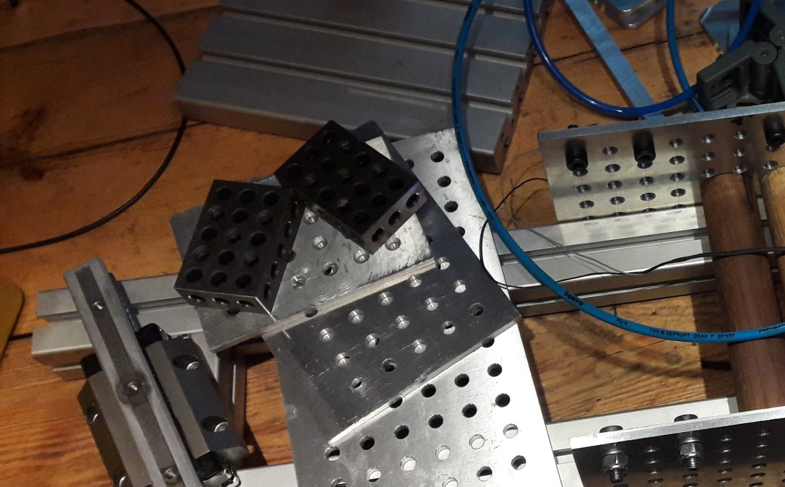

GridKit adds Construction-Kit-like modularity to your custom-made constructions.

The Workbench is (currently) very flat and contributes just one new Object and 2 Macros.

# Objects
## GridBox
This Objects creates a special BoundingBox and computes some Vectors of Dimensions and Counts. The size of the BoundingBox depends on the Shapes referenced and the properties. Most of the time you'll setup *Pitch* and *Start/End* conditions.

# Macros
## GridBox Array
"Projects" a 2D Array of an Object on face(s) of the GridBox's using a native "Draft::Array" and Expressions.

## GridBox Index
Places an Object on a indexed Position in the Grid of a GridBox using native Placement with Expressions.